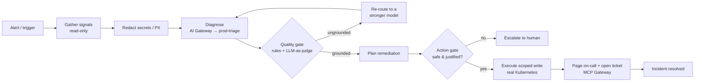

# Backstop

**An on-call SRE incident agent that fails safe — not just stays up.**

I built Backstop for the Resilient Agents hackathon (TrueFoundry × AWS Bedrock). Most takes on "resilient agents" answer one question: *what happens when the model goes down?* I wanted to answer the harder one I've actually watched cause outages: **what happens when the model is *up*, confident, and *wrong* — and the agent is about to act on it?**

Backstop watches a production incident, diagnoses the root cause with an LLM, and remediates it on a **real Kubernetes cluster** — but I engineered it so that a hallucinated diagnosis, a rate limit, a provider outage, a failed tool, or a cascade of small errors can **never** turn into a destructive action. It stays online *and* it refuses to do the dumb thing.

The demo I built runs **two agents against the same alert, side by side**: a *naive* agent (one model, every tool, no checks) and *Backstop*. The naive agent acts on a poisoned diagnosis and takes the production database to zero. Backstop gets the exact same bad diagnosis, catches it, re-routes to a stronger model, validates the fix, and rolls the bad deploy back — live, on the cluster, ending at `error_rate = 0.0`.

---

## Table of contents

- [The problem I set out to solve](#the-problem-i-set-out-to-solve)
- [What I built](#what-i-built)
- [Architecture](#architecture)
- [The triage loop, step by step](#the-triage-loop-step-by-step)
- [How I integrated TrueFoundry + AWS Bedrock](#how-i-integrated-truefoundry--aws-bedrock)
- [Engineering decisions & the hard problems](#engineering-decisions--the-hard-problems)
- [Resilience: the failure taxonomy](#resilience-the-failure-taxonomy)
- [The live console](#the-live-console)
- [Tech stack](#tech-stack)
- [Project layout](#project-layout)
- [Run it locally](#run-it-locally)
- [How I deployed it](#how-i-deployed-it)
- [Tests](#tests)

---

## The problem I set out to solve

Infrastructure fails. Rate limits hit. Timeouts happen. Providers go down. An agent with real remediation power has to survive all of that — and I do handle it.

But the failure that actually takes systems down is subtler: a **confident, plausible, wrong** model output. A hallucinated deploy SHA. A rollback scoped to *everything*. A "restart" pointed at the production database. The most capable model still does this, and an agent that executes blindly turns a bad token into an outage.

So I treated *"the model is wrong"* as a first-class failure mode, sitting right next to *"the model is down."* Every design decision below exists to make a wrong output **safe**.

## What I built

A Python triage agent that:

1. **Gathers** real signals — service health, recent deploy revisions, metrics, and warning events — from a Kubernetes cluster through a read-only path.
2. **Diagnoses** the root cause by asking an LLM (via the gateway) for a **structured** result, never free text.
3. **Validates** that diagnosis through a quality gate *and* validates the proposed fix through an action gate **before anything executes**.
4. **Acts** only on a validated, scoped remediation — or **escalates to a human** with the full context.
5. **Notifies** on-call and opens an incident ticket through governed (MCP) tool access.

I run it on a **local `kind` cluster with two namespaces** (`backstop-naive`, `backstop-hardened`), each with a `checkout` deployment and a protected `prod-db`. To create an incident I patch `checkout` to a non-existent image tag (`nginx:9.99-doesnotexist`), which produces a real `ImagePullBackOff` and zero ready pods — a genuine failure the agent has to reason about, not a mocked string.

**A note on the failure I inject — and what's honest about it.** This is controlled fault injection, the way you'd run a chaos experiment. The cluster break is real, and so is the remediation. The *poisoned diagnosis* (the "restart prod-db" hallucination) I inject deterministically so both agents face the **identical bad intermediate output** — that's the variable I'm isolating, and it makes the guardrail's catch reproducible on every run rather than something I have to hope the model does on camera. With `BACKSTOP_LIVE=true`, the re-diagnosis on the re-route, the LLM-as-judge, and the recovery all run against the live model on the gateway; only the first deliberately-bad output is scripted. I'm explicit about this because the point isn't "watch the model hallucinate" — it's "watch what happens to a wrong output *when* it occurs."

## Architecture



I designed the whole system around **four Pydantic contracts** — get the boundaries right and everything else composes:

| Contract | Role |
|---|---|
| `Signals` | The read-only ground truth: `services`, `recent_deploys`, `metrics`, `logs`, `protected_resources`. |
| `Diagnosis` | The structured LLM output: `hypothesis`, `suspected_resource`, `suspected_deploy_sha`, `confidence` (0–1), `recommended_action`. Never prose. |
| `ProposedAction` | A typed tool call (`rollback_deploy` / `scale_service`) with an explicit blast-radius `scope`. |
| `Verdict` | A guardrail result — `passed`, the individual `checks`, and human-readable `reasons` (rendered live in the UI). |

Everything streams as `RunEvent`s (`step`, `gate`, `fallback`, `action`, `blocked`, `breaker`, `done`) over Server-Sent Events, so the dashboard is just a live view of the agent's decision trail.

The cluster sits behind one interface, `InfraBackend`, with two implementations: `K8sBackend` (the real `kind` cluster — reads ReplicaSet revisions and ready-ratios, performs real image rollbacks and scales) and `MockBackend` (a deterministic fixture for tests). The agent never knows which one it's driving.

## The triage loop, step by step

This is `run_hardened`, and every step is failure-aware:

1. **Trigger** — an alert opens a triage run.
2. **Gather** — pull `Signals` from the cluster. Nothing destructive is reachable on this path; `prod-db` and `payments` are excluded from the actionable `services` list at the source.
3. **Redact** — I mask secrets and PII in the gathered logs *before the model ever sees them* (the cluster signals deliberately include a leaked `postgres://…` credential line so you can watch this work).
4. **Diagnose** — the gateway routes to `prod-triage` and returns a structured `Diagnosis`.
5. **Quality gate** — rule-based groundedness (`suspected_resource` must be a real service, `suspected_deploy_sha` must be a real recent deploy, `confidence` ≥ 0.5) **plus an independent LLM-as-judge** that reasons about whether the action is actually justified by the evidence. **Fail → re-route** to a stronger model and re-diagnose.
6. **Plan** — turn the validated diagnosis into a typed `ProposedAction`.
7. **Action gate** — before any write: reject `scope=all` (blast radius), reject protected resources, confirm the target exists, and confirm the action matches the diagnosis. **Fail → block and escalate** — the destructive action simply never runs.
8. **Execute** — only a validated action runs, against the real cluster, through a narrow write path; tool failures are caught and degrade to a human hand-off.
9. **Notify** — page on-call and open an incident ticket through the MCP Gateway.
10. **Resolve** — re-gather to confirm the heal (`error_rate → 0.0`).

The `run_naive` path skips steps 3, 5, 7, and the tool-failure handling — it trusts the first output and has every tool in hand, so it executes the catastrophe. That contrast *is* the demo.

## How I integrated TrueFoundry + AWS Bedrock

Every capability below is wired through the platform, not faked.

### AI Gateway + Virtual Models
I point the OpenAI SDK at the gateway (`base_url` + a virtual key) and call a single **virtual model, `prod-triage`**, that I configured with a **priority fallback chain over AWS Bedrock**: **Claude Sonnet → Llama 4 Maverick → Amazon Nova Pro → Claude Haiku**, with retry/fallback on `401/403/404/408/429/5xx`. The agent calls one model name; the gateway handles failover. I also attached a **rate-limit policy** (to force and demonstrate live failover) and a **budget/cost-limit policy** across the chain. Every call carries `X-TFY-LOGGING-CONFIG`, so request traces, fallback events, and per-model cost land in **AI Monitoring**.

### Guardrails
I registered a guardrail group and applied it to `prod-triage` with a policy that runs on both the **LLM Input** and **LLM Output** hooks:
- **Input (redact):** native **Secrets Detection** + **PII/PHI** guardrails, in *mutate* mode, mask credentials/tokens/PII before the model sees them.
- **Output (validate):** a **custom guardrail** I built and host (`/tfy/quality`) validates the model's response shape and confidence.
- **In-agent (the core fail-safe logic):** the groundedness, blast-radius and justification checks run *in the agent* as pure, unit-tested functions, backed by the LLM-as-judge — so a wrong output can't reach the cluster even if a platform check is lenient.

### MCP Gateway
- **Official remote MCP (Linear):** on resolution, the agent pages on-call and files an incident ticket through a **curated virtual MCP server** that exposes *only* safe tools (ticket creation), with destructive tools toggled off and auth managed centrally.
- **Custom MCP endpoint:** I built a read-only "infra" MCP server with FastMCP (`get_signals`, `deployment_status`, `namespaces`) and connected it to the gateway over streamable-http, so live cluster state is reachable through the MCP layer with a full audit trail. I kept it strictly read-only by design — no destructive tool is ever exposed.

### Prompts
The diagnosis system prompt is **versioned in the prompt registry** and fetched at runtime via the TrueFoundry SDK, with a production-grade local prompt as a fallback if the registry is unreachable.

## Engineering decisions & the hard problems

A few things I'm proud of, and the bugs that taught me something:

- **Structured-output-or-nothing.** The model never returns prose. It returns a `Diagnosis` I can validate field-by-field. That single decision is what makes the quality and action gates possible.
- **The action gate is the real differentiator.** `check_action` enforces blast radius (`scope != all`), protected resources (`prod-db`, `payments`), target existence, and *match-to-evidence*. This logic lives in my code, as pure functions, so it's deterministic and testable — the platform guardrails are defense-in-depth around it.
- **LLM-as-judge.** Rule checks catch structural problems; I added an independent judge call that *reasons* — e.g. on the live cluster it returned *"all signals point to an ImagePullBackOff… prod-db is not implicated by any metric or log error,"* rejecting the hallucination in plain English. It's resilient (errors never block) and gated behind a flag.
- **The failover-parsing bug — my favourite catch.** Under the rate limit, the gateway fails over to Llama, which wraps JSON in markdown fences *and* trailing prose. My naive "first `{` to last `}`" extractor choked on that, which meant my diagnosis was quietly fragile *exactly during failover* — the worst possible time. I rewrote `_extract_json` as a **balanced-brace scanner that respects string escapes** and returns the first complete JSON object, so the whole Sonnet→Llama→Nova chain degrades cleanly regardless of formatting.
- **Cascade circuit breaker.** An anomaly budget tracks failures across a run; once it trips, the agent halts autonomous action and escalates instead of amplifying a cascade.
- **Real, reversible chaos.** `inject_incident` patches a bad image; `apply` rolls back to the *actual previous ReplicaSet image* and waits for the rollout — no fake "healed" flags. The mock backend mirrors the same newest-first deploy ordering as the real one so behaviour is identical across both.
- **Verifiable by default.** Every run emits a tamper-evident audit receipt (hash-chained over the event timeline), so a reviewer can confirm exactly which models, guardrails, and tools fired without trusting my word for it.
- **Hermetic tests.** A `conftest.py` fixture disables every network-dependent setting, so the 60-test suite runs in ~2s and never touches the gateway.

## Resilience: the failure taxonomy

| Failure mode | How Backstop handles it |
|---|---|
| **Rate limits** | Priority fallback chain — a `429` fails over to the next model automatically; a rate-limit policy makes it observable on demand. |
| **Model / provider outage** | The same chain: Sonnet → Llama → Nova → Haiku, with retry/fallback on auth/timeout/5xx. |
| **Slow responses** | Gateway-level routing + timeouts fail over instead of hanging. |
| **Tool failures** | Caught per call; the run degrades to a human hand-off with full context. |
| **Bad intermediate outputs** | The quality gate — rules **plus** an LLM-as-judge — catches ungrounded diagnoses and re-routes. The headline defense. |
| **Cascading errors** | An anomaly-budget **circuit breaker** trips and escalates instead of amplifying the cascade. |
| **Destructive actions** | The action gate + scoped tools make a catastrophic write structurally unreachable. |
| **Malformed failover output** | The balanced-JSON extractor parses any model's formatting, so a provider switch never corrupts a diagnosis. |
| **Cost blow-ups** | A cheap judge model, a budget policy, and a loop cap bound spend. |

## The live console

The `/run` console is a live view of the agent's decision trail. A **scenario bar** lets you inject any failure mode with one click and watch a *different* defense fire:

| Scenario | What fires |
|---|---|
| **Hallucinated diagnosis** | quality gate + LLM-as-judge catch the wrong output → re-route → resolve |
| **Cascading failure** | a diagnosis that stays wrong → circuit breaker trips → escalate |
| **Tool failure** | the cluster API fails mid-action → the naive agent crashes, Backstop catches it and escalates |
| **Clean signal** | a grounded diagnosis → every gate passes → resolve (proves no false-positives) |
| **Model failover** | the gateway fails the primary over to the next model, live |

Each run streams the *naive* and *Backstop* columns side by side, lights up the capability panel as each platform feature engages, shows real ready-replica counts diverge between the two namespaces, and ends with an auto-generated incident report.

Every run also produces a **tamper-evident Incident Receipt** — a downloadable JSON audit of exactly what happened: which platform capabilities engaged, every guardrail decision, the actions blocked vs executed, the fallbacks fired, and the full event timeline, stamped with a **SHA-256 integrity hash** anyone can recompute from the timeline. It's the verifiable record that the agent did what it claims.

There are sub-pages for **Cluster** (live deployment health), **Guardrails** (every check and what it enforces), and **Incidents** (run history); **Observability** links straight to the gateway's monitoring. The console is self-explaining when idle (it renders both agents' full pipelines before you trigger anything) and fully responsive on mobile.

## Tech stack

- **Backend:** Python 3.12, `uv`, Pydantic v2, FastAPI, `sse-starlette`, the OpenAI SDK (pointed at the gateway), `fastmcp`, the Kubernetes client, `pytest`.
- **Infrastructure:** a real Kubernetes cluster via local `kind` (Docker).
- **Frontend:** Next.js 16, React 19, Tailwind CSS v4.
- **Platform:** TrueFoundry AI Gateway + MCP Gateway + Guardrails + Prompts, over AWS Bedrock.

## Project layout

```
backend/
  backstop/
    contracts.py          # the four core models + RunEvent
    agent.py              # the hardened + naive triage loops
    llm.py                # gateway client, structured diagnosis, LLM-as-judge, JSON extractor
    prompts.py            # managed-prompt fetch (with local fallback)
    breaker.py            # anomaly-budget circuit breaker
    events.py             # SSE event bus with replay
    report.py             # incident report + tamper-evident audit receipt
    runner.py             # naive-vs-hardened orchestration
    api.py                # run API (demo+scenario, events, state, runs, report, receipt, reset, fallback)
    notify.py             # MCP notify / ticket step
    mcp.py                # MCP gateway client
    infra_mcp.py          # read-only custom infra MCP server (FastMCP)
    guardrails/
      quality.py          # groundedness gate
      action.py           # blast-radius / protected / matches-evidence gate
      pii.py              # secret + PII redaction
      server.py           # platform-compatible custom guardrail endpoints
    infra/
      base.py             # InfraBackend interface
      k8s.py              # real Kubernetes backend
      mock.py             # deterministic test backend
  k8s/                    # sandbox manifests (checkout + prod-db)
  tests/                  # 60-test suite, network-isolated
frontend/
  app/
    components/           # landing page
    run/                  # the live incident console + sub-pages
deploy/                   # setup script, pm2 ecosystem, cloudflared / nginx configs
```

## Run it locally

**Prerequisites:** Docker, `kind`, `kubectl`, `uv`, Node 20+.

```bash
# 1. sandbox cluster
kind create cluster --name backstop
for ns in backstop-naive backstop-hardened; do
  kubectl create namespace "$ns"
  kubectl apply -n "$ns" -f backend/k8s/app.yaml
done

# 2. backend
cd backend
cp .env.example .env        # fill in gateway + Bedrock config
uv sync
uv run uvicorn backstop.api:app --port 8033
uv run uvicorn backstop.guardrails.server:app --port 8133
uv run python -m backstop.infra_mcp

# 3. frontend
cd frontend && npm install && npm run dev   # http://localhost:3033/run
```

Open the console, hit **Trigger incident**, and watch the two agents diverge. Key env flags: `BACKSTOP_LIVE=true` (use the live model on re-route), `BACKSTOP_LLM_JUDGE=true` (enable the LLM-as-judge), `BACKSTOP_BACKEND=kind`.

## How I deployed it

I host the backend on a VPS so the custom guardrails and custom MCP server have stable HTTPS URLs the gateway can reach. The three backend services bind to localhost on fixed ports (`8033` API, `8133` guardrails, `8233` MCP), run under **pm2**, and are exposed through a **Cloudflare tunnel** (TLS terminated at the edge — no inbound 80/443 needed, no clash with the box's existing nginx). `deploy/` has the `setup.sh`, the pm2 `ecosystem.config.js`, and both the cloudflared and nginx configs. The guardrail group's custom check and the `backstop-infra` MCP server are registered in TrueFoundry against those public URLs.

## Tests

```bash
cd backend && uv run pytest    # 60 passed in ~2s
```

The suite covers the contracts, both guardrails, the redactor, the breaker, the event bus, the JSON extractor (including verbose-failover output), the agent's happy path and every failure branch, each injectable scenario, the runner, the report generator, the tamper-evident receipt, the prompt fallback, and the platform-compatible guardrail endpoints. The Kubernetes backend is verified end-to-end against a live cluster.
