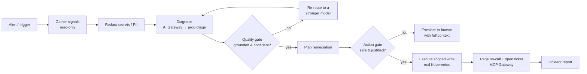

# Backstop

**An on-call SRE incident agent that fails safe — not just stays up.**

> Most "resilient agent" designs answer one question: *what happens when the model goes down?*
> Backstop answers the harder one every on-call engineer actually loses sleep over:
> **what happens when the model is *up* but *wrong* — and the agent is about to act on it?**

Backstop watches a production incident, diagnoses the root cause with an LLM, and remediates it on a **real Kubernetes cluster** — engineered so that a hallucinated diagnosis, a rate limit, a provider outage, a failed tool, or a cascade of small errors can **never** become a destructive action. It stays online *and* it refuses to do the dumb thing.

The signature view runs **two agents against the same alert, side by side** — a *naive* agent (one model, every tool, no checks) and *Backstop*. The naive agent acts on a poisoned diagnosis and causes a real outage. Backstop catches it, re-routes to a stronger model, validates the fix, and recovers — live, on the cluster.

---

## Table of contents

- [The problem](#the-problem)
- [What Backstop does](#what-backstop-does)
- [Architecture](#architecture)
- [The triage loop, step by step](#the-triage-loop-step-by-step)
- [Resilience: the failure taxonomy](#resilience-the-failure-taxonomy)
- [Platform integration (TrueFoundry + AWS Bedrock)](#platform-integration-truefoundry--aws-bedrock)
- [The live console](#the-live-console)
- [Tech stack](#tech-stack)
- [Project layout](#project-layout)
- [Run it locally](#run-it-locally)
- [Configuration](#configuration)
- [Deploying the backend](#deploying-the-backend)
- [Tests](#tests)

---

## The problem

Infrastructure fails. Rate limits hit. Timeouts happen. Providers go down. An agent that's been given real remediation power has to survive all of that.

But the failure that actually takes systems down is subtler: a **confident, plausible, wrong** model output. A hallucinated deploy SHA. A rollback scoped to *everything*. A restart aimed at the production database. The most capable model on earth still does this — and an agent that executes blindly turns a bad token into an outage.

Backstop treats *"the model is wrong"* as a first-class failure mode, sitting right next to *"the model is down."* Everything below exists to make a wrong output **safe**.

## What Backstop does

1. **Triages** a live incident from real signals — service health, recent deploy revisions, metrics, and warning events — gathered from a Kubernetes cluster through a read-only path.
2. **Diagnoses** the root cause by asking an LLM for a **structured** result (`hypothesis`, `suspected_resource`, `suspected_deploy_sha`, `confidence`, `recommended_action`) — never free text.
3. **Validates** that diagnosis through a **quality gate** (is it grounded in the evidence?) and validates the proposed fix through an **action gate** (is this write safe?) *before anything executes*.
4. **Acts** only on a validated, scoped remediation — or **escalates to a human** with the full context.
5. **Notifies** on-call and opens an incident ticket through governed tool access, leaving an audit trail.

## Architecture



The system is small, typed, and split by responsibility. Four Pydantic contracts are the spine — get them right and every component composes:

| Contract | Role |
|---|---|
| `Signals` | The read-only ground truth: known services, recent deploy hashes, metrics, logs, protected resources. |
| `Diagnosis` | The structured LLM output. Never prose. |
| `ProposedAction` | A typed tool call (`rollback_deploy` / `scale_service`) with an explicit blast-radius `scope`. |
| `Verdict` | A guardrail result — which checks passed, and why any failed (rendered live in the UI). |

Around those contracts:

- **`InfraBackend`** — one interface over the cluster, with two implementations: **`K8sBackend`** (a real local `kind` cluster — reads deployment revisions/ready-ratios/events, performs real `rollback`/`scale`) and **`MockBackend`** (a deterministic in-memory fixture for tests and a last-resort fallback). The agent never knows which one it's driving.
- **Agent loop** — an explicit triage state machine (`run_hardened`, `run_naive`).
- **Guardrails** — the quality gate and action gate as **pure, unit-tested functions**, plus secret/PII redaction.
- **Circuit breaker** — an anomaly budget that tracks failures across a run.
- **Event bus** — every step emits a `RunEvent`; the bus streams them over **Server-Sent Events** and keeps a replayable per-run history.
- **LLM client** — the OpenAI SDK pointed at the gateway, using a **managed prompt** fetched at runtime.
- **Run API** (FastAPI) — `POST /demo`, `GET /events/{id}` (SSE), `GET /state`, `GET /runs`, `GET /report/{id}`, `POST /reset`, `GET /fallback-test`.
- **Guardrail server** (FastAPI) — standalone endpoints that implement the platform's custom-guardrail contract.
- **Infra MCP server** — exposes read-only cluster signals as MCP tools.
- **Console** (Next.js) — the live incident dashboard.

## The triage loop, step by step

Every step is failure-aware. This is the hardened path:

1. **Trigger.** An alert opens a triage run.
2. **Gather (read-only).** Pull signals from the cluster. Nothing destructive is reachable on this path.
3. **Redact.** Secrets and PII in the gathered logs are masked *before the model sees them*.
4. **Diagnose.** The gateway routes to the primary model and returns a structured `Diagnosis`.
5. **Quality gate.** Is the diagnosis grounded? `suspected_resource` must be a real service, `suspected_deploy_sha` must be a real recent deploy, confidence must clear a threshold. **Fail → re-route** to a stronger model and re-diagnose; if it's still ungrounded, degrade gracefully and hand off to a human.
6. **Plan.** Turn the validated diagnosis into a typed `ProposedAction`.
7. **Action gate.** Before any write: reject `scope=all` (blast radius), reject protected resources (`prod-db`, `payments`), confirm the target exists, and confirm the action actually matches the evidence. **Fail → block and escalate** — the destructive action simply never runs.
8. **Execute (scoped write).** Only a validated action runs, against the real cluster, through a narrow write path.
9. **Tool failures** are caught and degrade to a human hand-off rather than crashing.
10. **Notify.** Page on-call and open an incident ticket through governed tool access.
11. **Report.** An incident summary is generated from the run's event history — root cause, what was caught, what was executed.

The **naive** agent skips 3, 5, 7, and 9 — it trusts the first output and has every tool in hand, so it executes the catastrophe.

## Resilience: the failure taxonomy

Resilience here means more than "stay online" — it means *degrade safely* across the whole spectrum of failures.

| Failure mode | How Backstop handles it |
|---|---|
| **Rate limits** | Priority fallback chain — a `429` on the primary fails over to the next model automatically. A rate-limit policy on the primary makes this observable on demand. |
| **Model / provider outage** | The same priority chain: Claude Sonnet → Llama → Nova → Haiku, each with retry/fallback on `401/403/404/408/429/5xx`. |
| **Slow responses** | Gateway-level routing and timeouts fail over instead of hanging. |
| **Tool failures** | Caught per-call; the run degrades to a human hand-off with full context rather than crashing. |
| **Bad intermediate outputs** | The **quality gate** catches ungrounded diagnoses and re-routes to a stronger model — the headline defense. |
| **Cascading errors** | An **anomaly budget** tracks failures across steps; the agent stops escalating risk and hands off instead of amplifying. |
| **Destructive actions** | The **action gate** plus scoped tools make a catastrophic write structurally unreachable. |
| **Cost blow-ups** | A cheap model does the validation work, a budget cap guards spend, and a loop cap bounds runaway iterations. |
| **State** | Every step is event-sourced into a replayable per-run history; on failure the agent escalates *with* that state instead of losing it. |

## Platform integration (TrueFoundry + AWS Bedrock)

Every capability below is wired through the platform, not faked.

### AI Gateway

- **Virtual model with a priority fallback chain** (`prod-triage`): **Claude Sonnet → Llama 4 Maverick → Amazon Nova Pro → Claude Haiku** on AWS Bedrock. The agent calls one virtual model; the gateway fails over.
- **Rate-limit policy** on the primary target — demonstrates live failover.
- **Budget / cost-limit policy** caps spend across the chain.
- **Observability** — every LLM call is logged through the gateway, so request traces, fallback events, and per-model cost surface in monitoring.

### MCP Gateway

- **Official remote MCP (Linear)** — on resolution, the agent pages on-call and opens an incident ticket through a **curated virtual MCP server** that exposes *only* the safe tools (ticket creation), with destructive tools toggled off and auth managed centrally.
- **Custom MCP endpoint** — a read-only "infra" MCP server (`get_signals`, `deployment_status`, `namespaces`) exposes live cluster state through the gateway, with a full tool audit trail.
- Tool access is scoped, authenticated centrally, and audited — destructive capabilities never enter the agent's toolset.

### Guardrails

- **Input — redact:** native **Secrets Detection** and **PII/PHI** guardrails mask credentials and sensitive data on the request path.
- **Output — validate:** a **custom guardrail** validates the model's diagnosis for schema and confidence on the response path.
- **In-agent — the core fail-safe logic:** the groundedness (quality) and blast-radius/justification (action) checks run in the agent itself, as pure tested functions, so a wrong output cannot reach the cluster.

### Prompts

- The diagnosis system prompt is **versioned in the prompt registry** and fetched at runtime, so the agent's instructions are managed centrally rather than hardcoded.

## The live console

A single screen makes the whole story legible:

- **Trigger an incident** → the *naive* and *Backstop* columns stream their steps live (SSE).
- **Naive** ends in a real catastrophe (a protected service taken to zero, the incident unresolved). **Backstop** shows the bad diagnosis being caught, the re-route, the validated rollback, and resolution.
- A **capabilities panel** lights up each platform feature as it engages during the run.
- A **live cluster widget** shows real ready-replica counts diverge between the two namespaces.
- An **incident report** is generated at the end — root cause, what was caught, the action taken.
- Sub-pages for **Cluster** (live deployment health), **Guardrails** (every check and what it enforces), and **Incidents** (run history); **Observability** links straight to the gateway's monitoring.

## Tech stack

- **Backend:** Python 3.12, `uv`, Pydantic v2, FastAPI, `sse-starlette`, the OpenAI SDK (pointed at the gateway), `fastmcp`, the Kubernetes client, `pytest`.
- **Infrastructure:** a real Kubernetes cluster via local `kind` (Docker).
- **Frontend:** Next.js 16, React 19, Tailwind CSS v4.
- **Platform:** TrueFoundry AI Gateway + MCP Gateway + Guardrails + Prompts, over AWS Bedrock.

## Project layout

```
backend/
  backstop/
    contracts.py          # the four core models + RunEvent
    agent.py              # the hardened + naive triage loops
    llm.py                # gateway client + structured diagnosis
    prompts.py            # managed-prompt fetch (with local fallback)
    breaker.py            # anomaly-budget circuit breaker
    events.py             # SSE event bus with replay
    report.py             # incident report generator
    api.py                # run API (demo, events, state, runs, report, reset, fallback-test)
    runner.py             # naive-vs-hardened orchestration
    controller.py         # cluster/backends wiring
    notify.py             # MCP notify/ticket step
    mcp.py                # MCP gateway client
    infra_mcp.py          # read-only custom infra MCP server
    guardrails/
      quality.py          # groundedness gate
      action.py           # blast-radius / protected / matches-evidence gate
      pii.py              # secret + PII redaction
      server.py           # platform-compatible custom guardrail endpoints
    infra/
      base.py             # InfraBackend interface
      k8s.py              # real Kubernetes backend
      mock.py             # deterministic test backend
  k8s/                    # sandbox manifests (checkout + prod-db)
  tests/                  # full unit suite
frontend/
  app/
    components/           # landing page (dark, high-end)
    run/                  # the live incident console + sub-pages
deploy/                   # setup script, pm2 ecosystem, cloudflared / nginx configs
```

## Run it locally

**Prerequisites:** Docker, `kind`, `kubectl`, `uv`, Node 20+.

**1. Stand up the sandbox cluster**

```bash
kind create cluster --name backstop
for ns in backstop-naive backstop-hardened; do
  kubectl create namespace "$ns"
  kubectl apply -n "$ns" -f backend/k8s/app.yaml
done
```

**2. Backend**

```bash
cd backend
cp .env.example .env        # fill in your gateway + Bedrock config
uv sync
uv run uvicorn backstop.api:app --port 8033          # run API
uv run uvicorn backstop.guardrails.server:app --port 8133   # guardrail server
uv run python -m backstop.infra_mcp                  # read-only infra MCP
```

**3. Frontend**

```bash
cd frontend
npm install
npm run dev                 # http://localhost:3033/run
```

Open the console, hit **Trigger incident**, and watch the two agents diverge.

## Configuration

Backend (`backend/.env`):

| Variable | Purpose |
|---|---|
| `TRUEFOUNDRY_BASE_URL` | Gateway base URL |
| `TRUEFOUNDRY_API_KEY` | Gateway virtual key |
| `BACKSTOP_MODEL` | Virtual model name (the fallback chain) |
| `BACKSTOP_PROMPT_FQN` | Managed prompt FQN (optional; falls back to a built-in prompt) |
| `BACKSTOP_MCP_URL` | Virtual MCP server URL for notify/ticket (optional) |
| `BACKSTOP_LINEAR_TEAM` | Ticket target team (optional) |
| `BACKSTOP_LIVE` | `true` to use the live model on the re-route |
| `BACKSTOP_BACKEND` | `kind` (real cluster) or `mock` |

Frontend (build-time): `NEXT_PUBLIC_API_URL`, `NEXT_PUBLIC_TFY_OBSERVABILITY_URL`.

## Deploying the backend

`deploy/` contains a turnkey path to host the backend on any Ubuntu box:

- `setup.sh` — installs the toolchain and creates the cluster + sandbox.
- `ecosystem.config.js` — runs all services under **pm2** on fixed ports.
- `cloudflared-ingress.example.yml` / `nginx-backstop.conf` — expose the API, guardrail server, and infra MCP over HTTPS so the gateway can reach them (custom guardrails and the custom MCP register against these URLs).

See [`deploy/README.md`](deploy/README.md) for the full runbook.

## Tests

```bash
cd backend && uv run pytest
```

The suite covers the contracts, both guardrails, the redactor, the breaker, the event bus, the agent's happy path and every failure branch, the runner, the report generator, the prompt fallback, and the platform-compatible guardrail endpoints. The Kubernetes backend is verified end-to-end against a live cluster.
